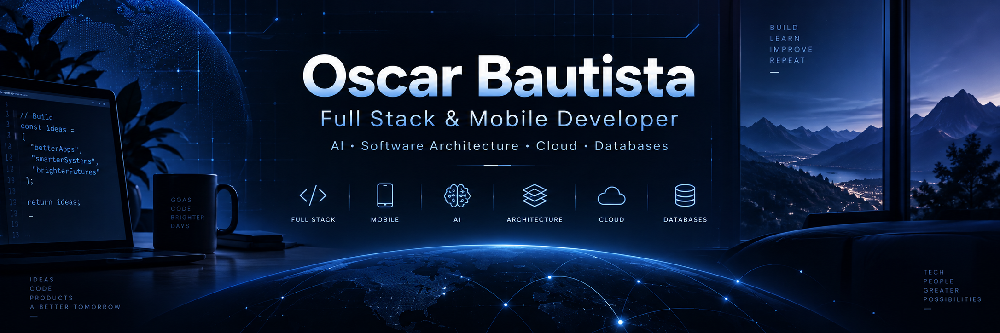

<p align="center">
  
</p>

<div align="center">

### 🚀 Full Stack Developer · 📱 Mobile Developer · 🤖 AI Enthusiast


<br>

[](https://www.linkedin.com/in/oscar-bautista-9921a2302/)
[](https://github.com/OscarCodev)


</div>

---

## 👨‍💻 Sobre mí

Soy **Oscar Bautista**, estudiante de **VIII ciclo de Ingeniería de Sistemas** y desarrollador orientado al ecosistema **Full Stack**, con especial interés en el desarrollo de aplicaciones móviles.

Me apasiona transformar ideas en productos digitales y comprender no solo **cómo desarrollar una aplicación**, sino también cómo diseñar sistemas **escalables, mantenibles y bien estructurados**.

Actualmente estoy profundizando mis conocimientos en **Arquitectura de Software**, mientras continúo explorando Inteligencia Artificial, Cloud Computing y tecnologías modernas para desarrollo web y móvil.

<br>

<div align="center">

| 💻 Desarrollo | 🧠 Tecnología | 🚀 Actualmente |
|:---:|:---:|:---:|
| Full Stack | Inteligencia Artificial | Arquitectura de Software |
| Mobile Apps | Cloud Computing | Sistemas escalables |
| Web Apps | Bases de Datos | Buenas prácticas |

</div>

---

## 🚀 Proyectos destacados

<table>
<tr>
<td width="50%" valign="top">

### 🤖 Closer

**Plataforma inteligente para entrenamiento de equipos de ventas mediante IA.**

Actualmente participo como **CTO**, trabajando en la evolución tecnológica del producto y en la construcción de herramientas que permitan entrenar y potenciar las habilidades de equipos comerciales.

<br>

`AI` `Full Stack` `SaaS` `Architecture`

</td>

<td width="50%" valign="top">

### 🌱 ActivateVerde

**Aplicación para reportar incidentes ambientales en tiempo real.**

Una solución orientada a facilitar la participación ciudadana mediante el registro y seguimiento de problemas ambientales desde dispositivos móviles.

<br>

`Flutter` `Supabase` `Real-time` `Mobile`

</td>
</tr>
</table>

---

## 🛠️ Tecnologías

<div align="center">

### 💻 Frontend


<br>

### 📱 Mobile


<br>

### ⚙️ Backend & Bases de Datos


<br>

### 🔧 Herramientas & DevOps


</div>

---

## 🧠 Áreas que me apasionan

<div align="center">

`💻 Full Stack` &nbsp;&nbsp;
`📱 Mobile Development` &nbsp;&nbsp;
`🤖 Inteligencia Artificial`

`🏗️ Software Architecture` &nbsp;&nbsp;
`☁️ Cloud Computing` &nbsp;&nbsp;
`🗄️ Databases`

</div>

---

## 📚 Actualmente aprendiendo

```text
🏗️  Arquitectura de Software
│
├── 🧩 Patrones de diseño
├── ⚡ Sistemas escalables
├── 🧱 Arquitecturas modernas
├── ☁️ Cloud Computing
├── 🐳 Contenedores y despliegue
└── 🤖 Integración de IA en productos reales
